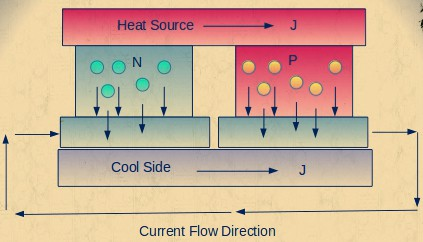
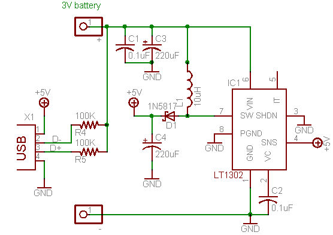
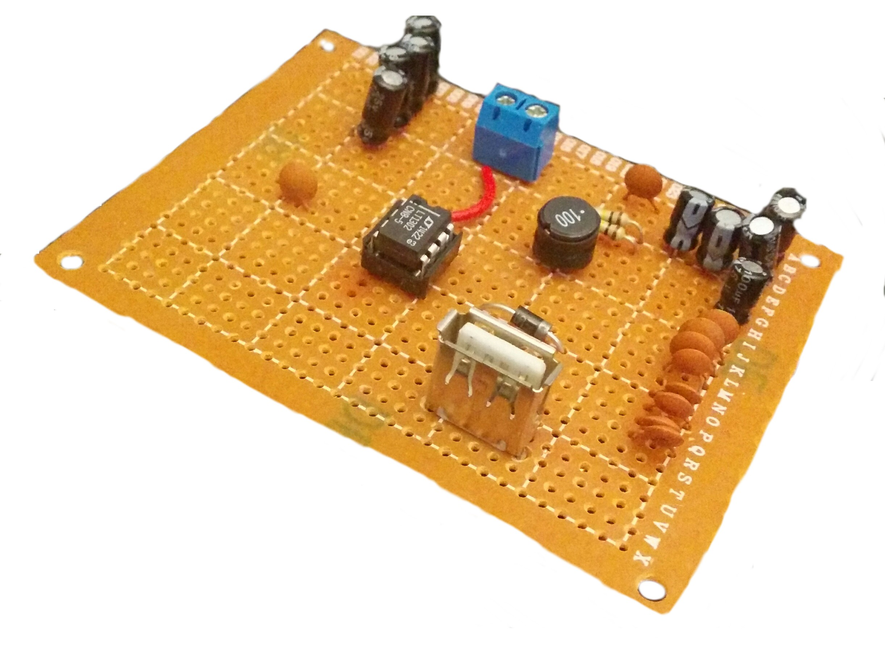
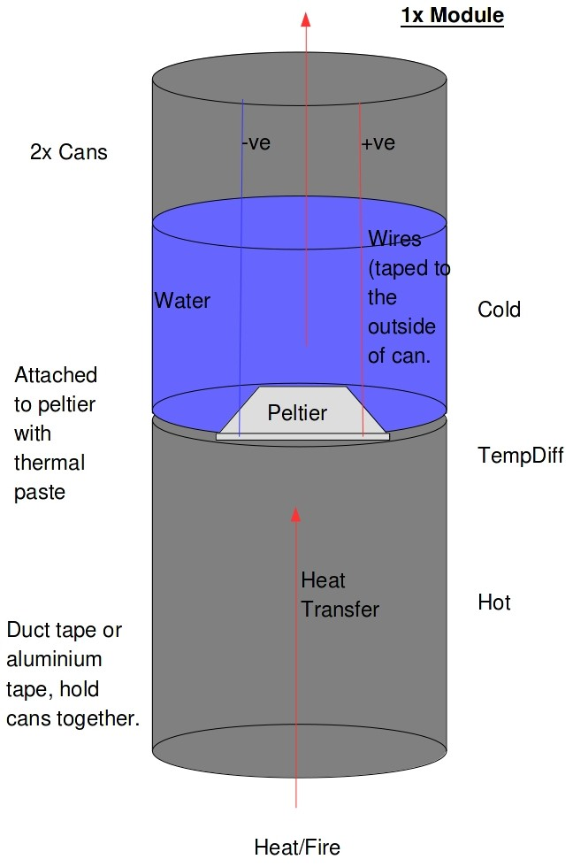
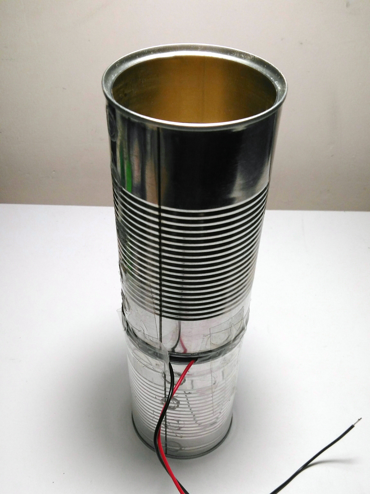
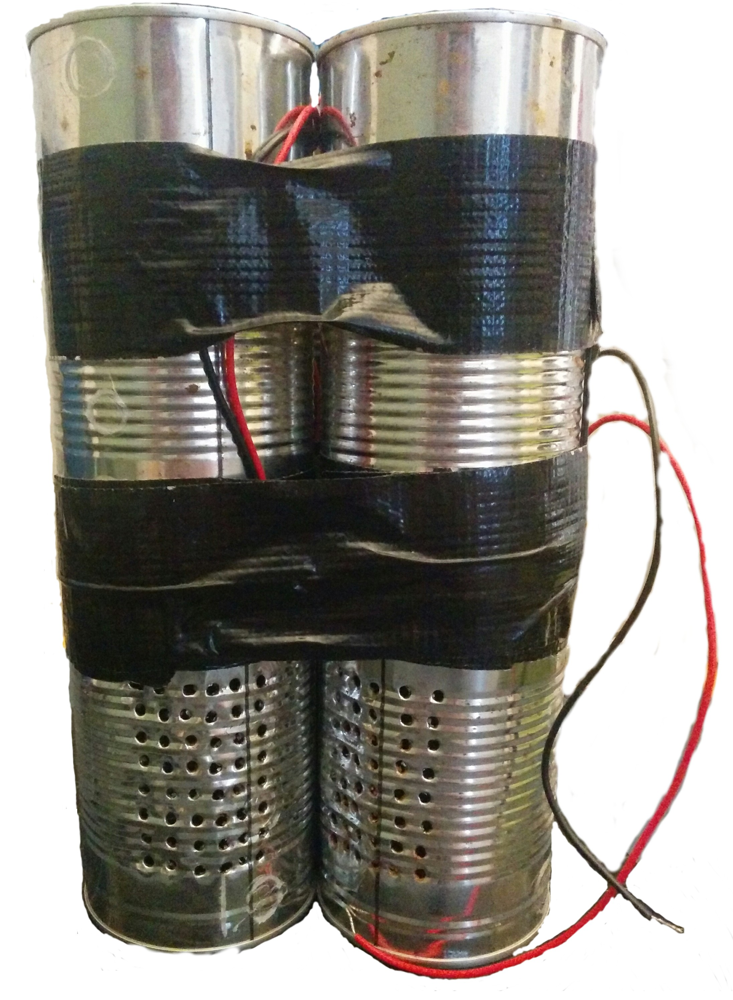
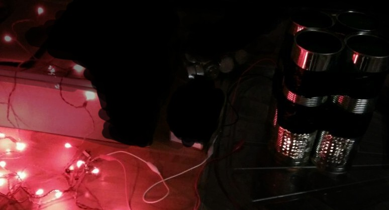

# Cheap Thermoelectric Generator

<!--
###AUTHOR###:Alex Vear
-->

### Date: 2015-11-08 - 2016-03-??

This page was originally hosted on [Hackaday.io](https://hackaday.io), but I
moved it here on 2018-03-24.

I know that this page is full of grammatical mistakes (and other various
errors), but I am intentionally leaving it as such for historical reasons.  Only
a few minor changes have been made to the original content (mainly removing the
[Hackaday.io](https://hackaday.io) terminology).

 

## Description

Building a Thermoelectric generator cheaply for survival camps.  Designed to be
very efficient. (They are also known as Seebeck Generators).  The TEG I am
building will be able to power/charge a 5V (at 600mA) device through a standard
USB "Type A" port.

 

 

## Details

### Why and how it works

Thermoelectric generators (TEG) work in an extremely clever way. TEGs work using
peltier devices which are essentially two ceramic plates with semiconductors
in-between. These are normally used in fridges and kettles for camping; when a
current is placed across the peltier, it can cause it to rapidly heat to boiling
in just a few minutes, or simply by reversing the polarity it can quickly drop
below freezing point.

By reverse engineering these small devices; rather than placing the current
through them we give the device a temperature difference on each ceramic plate
it will produce D.C. voltage (Emf-Electromotive force [battery voltage]). The
higher the temperature difference the higher the voltage generated.

This works because rather than giving the peltiers electrical energy to
create heat (or negative heat), we are providing the heat to get electricity
from the device.

It is known as the Seebeck effect (temperature difference to electricity), the
opposite of the Peltier effect (electricity to heat/temperature difference).

### The Circuit Schematic: 3V, 1A to 5V, 600mA.

This Schematic is a possible way to convert the output from the generator/s to
the required Current and Voltage. The 3V battery can be replaced with the TEG.
(Image: Adafruit - MintyBoost V2). For ease, the MintyBoost V3 can be used
instead and can be bought as a kit through [Adafruit](https://adafruit.com), the
battery connectors can then be attached to the correct leads on the TEG.

### The Module Design.

The design of each of the modules of the circuit. (I have changed the design
slightly, as to what is seen above, so that it has holes on one side of the
bottom can, see below). Each can of the module were attached securely using duct
tape (sellotape in the prototype - above).

 

## Final Notes

This device was a proof of concept, and performed brilliantly and fully worked,
with only four modules and four tea light candles, it was able to charge a
mobile phone to full charge. (I recommend not testing this on your own phone as
it may break it if the wiring was not correct or a component was damaged).

At some point in the future I may try to make a more efficient version of this.
Feel free to use this design or modify it as you wish.

This is an image of the TEG powering some LED lights.

 

## Useful Documents (Data Sheets)

- [Data Sheet for the TEC1-12706 Peltier I used in this
  project](docs/TEC1-12706_40,40,3.8.pdf).
- [LT1302 - Micropower High Output Current Step-Up Adjustable and Fixed 5V DC/DC
  Converter (Linear Technology)](docs/lt1302.pdf).
- [Voltage Regulator Data Sheet for the 78xx series, use if you want to have the
  current at 1A rather than 600mA. The original version was going to use
  this](docs/78xx.pdf).

 

## Components I Used

- **8 × Aluminium Cans (diameter greater than 5cm).** 2 per module.
- **4 × Peltiers TEC1-12706.** To generate the electricity.
- **1 × Thermal Paste 16g.** Used to attach the peltiers to the cans.
- **1 × Duct Tape or Aluminium Tape.** To hold the cans together.
- **1 × Candles or other form of heat (per module).** To provide the required energy (spares may be needed).
- **1 × LT1302CN8-5 IC.** For the Conversion Circuit.
- **2 × 220µF Capacitor.** For the Conversion Circuit.
- **2 × 0.1µF Capacitor.** For the Conversion Circuit.
- **2 × 100K Resistor.** For the Conversion Circuit.
- **1 × 1N5818 Schottky Diode.** For the Conversion Circuit.
- **1 × 10µH Power Inductor 2A+.**For the Conversion Circuit.
- **1 × USB Type A female Socket.** For the Conversion Circuit.
- **1 × 8Pin IC Socket.** For the Conversion Circuit.
- **1 × Perfboard.** For the Conversion Circuit.
- **1 × Soldering Iron**.
- **1 × Solder**.
- **1 × Needle Nose Pliers.** To bend the through hole components.
- **1 × Power Drill.** Make the Air holes in the modules.
